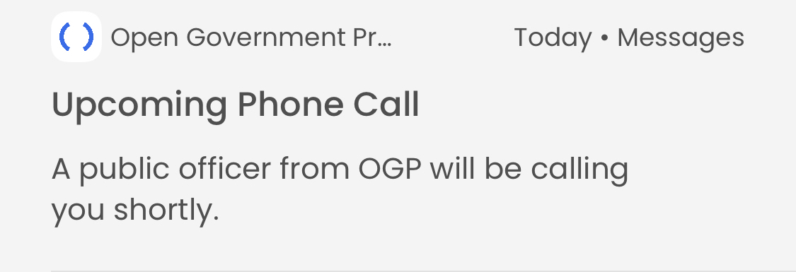
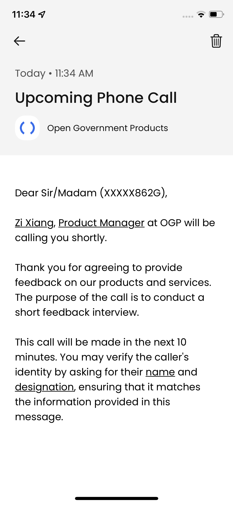
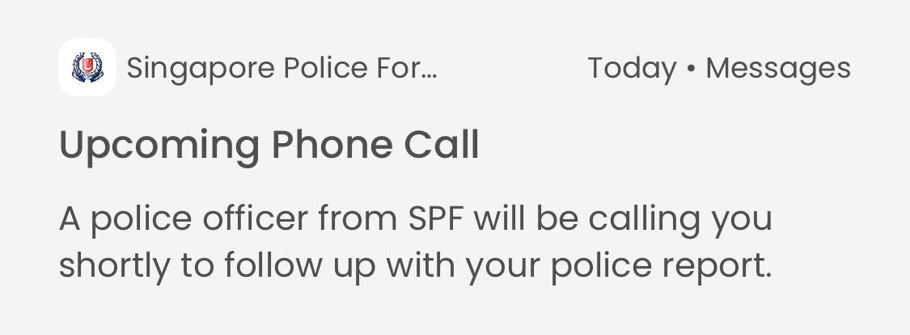
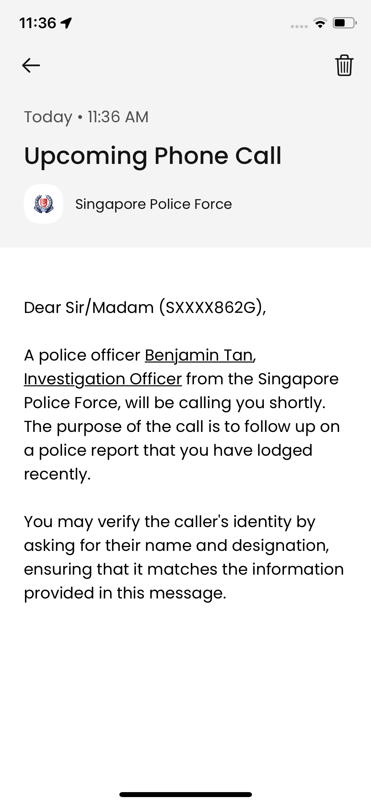
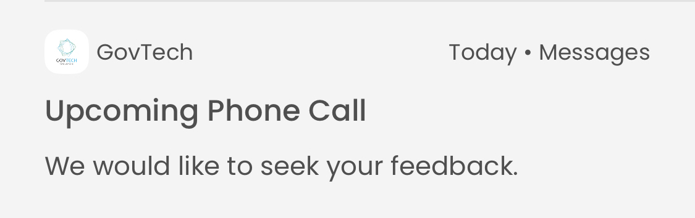
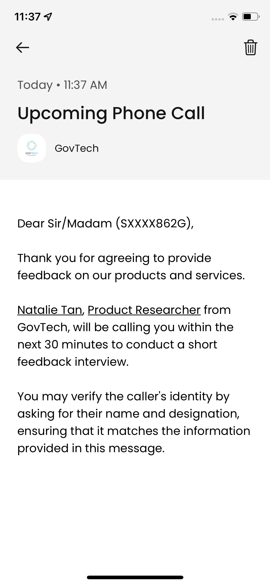

# Approved Templates

## Introduction

The purpose of this file is to keep track of all the message templates approved by the GovTech Communications & Marketing Group (CMG) team and the parameters that need to be passed to the template.

Whenever SG-Notify team informs us of any changes to the message templates, we should update this file accordingly. This will help to ensure we know what messages are being sent to the MOPs.

## Template Structure

Each message template contains the following attributes:

- Title (50 characters)
- Short Message (100 characters)
- Long Message (1000 characters)
- List of parameters that must be included in the API call and substituted into the message
- Whether HTML is enabled

## List of Approved Templates

The following templates have been approved by the CMG team:

- `GOVTECH-CHECKWHO-GEN-01`: this is the generic template for notify MOPs _before_ phone calls.
- `GOVTECH-CHECKWHO-GEN-02`: this is the generic template for notifying MOPs _during_ phone calls.
- `GOVTECH-CHECKWHO-01`: this is the SPF police report-specific template.
- `GOVTECH-CHECKWHO-GT-01`: this is the GovTech feedback-specific template.

Currently, the backend is only using the `GOVTECH-CHECKWHO-GEN-01` template as it is the most generic and thus flexible.

### Template ID: `GOVTECH-CHECKWHO-GEN-01`

#### Title

Upcoming Phone Call

#### Short Message

A public officer from &lt;agency&gt; will be calling you shortly.

#### Long Message

> Dear Sir/Madam <masked_NRIC>,
>
> <officer_name>, &lt;position&gt; at &lt;agency&gt; will be calling you shortly.
>
> <call_details>
>
> <callback_details>

#### HTML-enabled

Yes

#### Example API Call

```
template_layout: [
  {
    template_id: "GOVTECH-CHECKWHO-GEN-01",
    template_input: {
      masked_nric: "(SXXXX862G)",
      officer_name: "<u>Zi Xiang</u>",
      position: "<u>Product Manager</u>",
      agency: "OGP",
      call_details: `Thank you for agreeing to provide feedback on our products and services. The purpose of the call is to conduct a short feedback interview.
      <br><br>
      This call will be made in the next 10 minutes. You may verify the caller's identity by asking for their <u>name</u> and <u>designation</u>, ensuring that it matches the information provided in this message.`,
      callback_details: " ", // cannot be blank or SGNotify will reject the request
    },
  },
],
```

#### Screenshots


<br>


### Template ID: `GOVTECH-CHECKWHO-01`

#### Title

Upcoming Phone Call

#### Short Message

A police officer from SPF will be following up with your police report.

#### Long Message

> Dear Sir/Madam <masked_NRIC>,
>
> A police officer <officer_name>, &lt;position&gt; from the Singapore Police Force, will be calling you shortly. The purpose of the call is to follow up on a police report that you have lodged recently.
>
> You may verify the caller's identity by asking for their name and designation, ensuring that it matches the information provided in this message.

#### HTML-enabled

Yes

#### Example API Call

```
template_layout: [
  {
    template_id: "GOVTECH-CHECKWHO-01",
    template_input: {
      masked_nric: "(SXXXX862G)",
      officer_name: "<u>Benjamin Tan</u>",
      position: "<u>Investigation Officer</u>",
    },
  },
],
```

#### Screenshots


<br>


### Template ID: `GOVTECH-CHECKWHO-GT-01`

#### Title

Upcoming Phone Call

#### Short Message

We would like to seek your feedback.

#### Long Message

> Dear Sir/Madam <masked_NRIC>,
>
> Thank you for agreeing to provide feedback on our products and services.
>
> <officer_name>, &lt;position&gt; from GovTech, will be calling you within the next 30 minutes to conduct a short feedback interview.
>
> You may verify the caller's identity by asking for their name and designation, ensuring that it matches the information provided in this message.

#### HTML-enabled

Yes

#### Example API Call

```
template_layout: [
  {
    template_id: "GOVTECH-CHECKWHO-GT-01",
    template_input: {
      masked_nric: "(SXXXX862G)",
      officer_name: "<u>Natalie Tan</u>",
      position: "<u>Product Researcher</u>",
    },
  },
],
```

#### Screenshots


<br>


### Template ID: `GOVTECH-CHECKWHO-GEN-02`

#### Title

Verify your phone call

#### Short Message

You are currently on a call with a public officer from <agency>

#### Long Message

```
Dear Sir/Madam <masked_nric>,

This message is to verify that you are currently speaking to <officer_name>, <position> from <agency>.

<call_details>
```

#### HTML-enabled

Yes

#### Example API Call

```
template_layout: [
  {
    template_id: "GOVTECH-CHECKWHO-GEN-02",
    template_input: {
      masked_nric: "(SXXXX862G)",
      officer_name: "<u>Louiz Kim-Chan</u>",
      position: "<u>Potato Man</u>",
      agency: "OGP",
      call_details: `My favorite food is: potato!
      <br><br>
      Please ask the caller what his favorite food is to verify his/her identity.`,
    },
  },
],
```

#### Screenshots

TODO

## Copy below for new template

### Template ID: ``

#### Title

#### Short Message

#### Long Message

#### HTML-enabled

#### Example API Call

#### Screenshots

## Future Extension

Express these message templates in code, which can be used to generate the exact message with the proper formatting.
